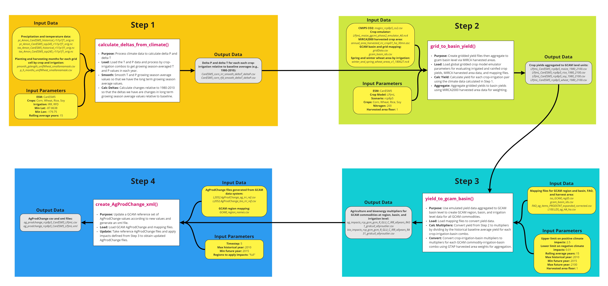
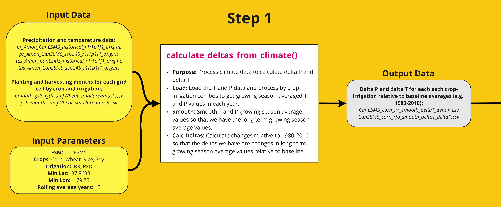
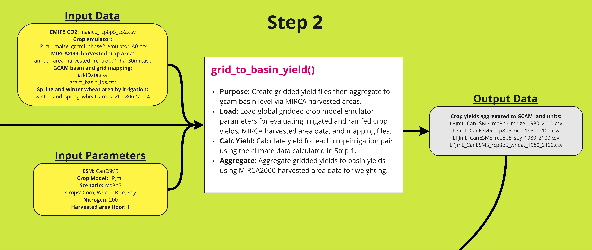
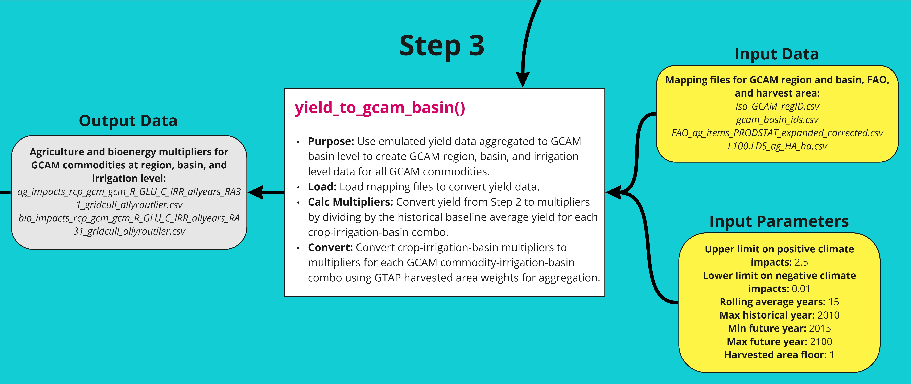
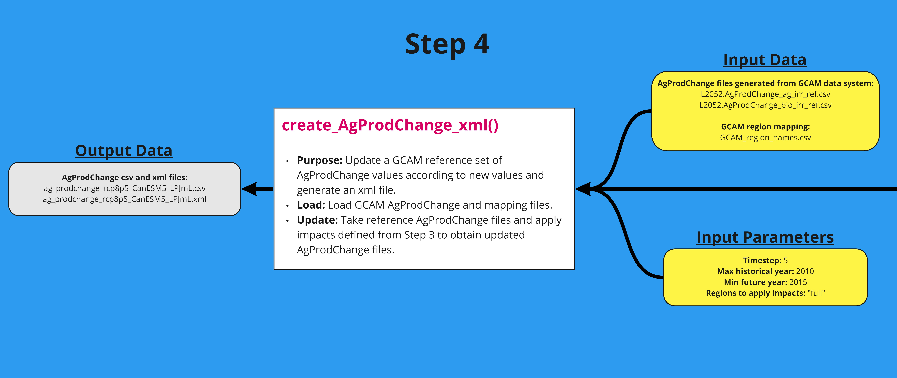

<!-------------------------->
<!-------------------------->
<!-- HTML styles items    -->
<!-------------------------->
<!-------------------------->

<style>
.button {
  background-color: #555555;
  border-radius: 8px;
  border: none;
  color: white;
  padding: 15px 32px;
  text-align: center;
  text-decoration: none;
  display: inline-block;
  font-size: 16px;
  margin: 4px 2px;
  cursor: pointer;
}

.button:hover {
  box-shadow: 0 12px 16px 0 rgba(0,0,0,0.24), 0 17px 50px 0 rgba(0,0,0,0.19);
  background-color: #555555;
  color: gold;
}

</style>

<!-------------------------->
<!-------------------------->
# Introduction
<!-------------------------->
<!-------------------------->
<p align="center"> </p>

Osiris is an R package that is used to process climate impacts on agricultural yields for the Global Change Analysis Model (GCAM). This package is a modular data pipeline that consists of four steps that take gridded crop yield data from existing emulators and transforms them into agricultural yield impacts for GCAM commodities. The four functions are run in series as follows, with a detailed workflow below:
* calculate_deltas_from_climate() – obtain precipitation and temperature data for each crop and irrigation type, as well as the difference relative to baseline average
* grid_to_basin_yield() – use global gridded crop model emulator output to generate crop yield and aggregate to GCAM basins
* yield_to_gcam_basin() – convert agricultural yield data to multipliers for each GCAM commodity-irrigation-basin
* create_AgProdChange_xml() – apply multipliers to AgProdChange from GCAM reference and obtain a new file in xml format

<p align="center" style="font-size:18px;"> *Workflow Summary* </p>
<p align="center"> </p>

<p align="center" style="font-size:18px;"> *Workflow Details* </p>
<p align="center"> </p>


<!-------------------------->
<!-------------------------->
# Install
<!-------------------------->
<!-------------------------->
<p align="center"> </p>

1. Download and install:
    - R (https://www.r-project.org/)
    - R studio (https://www.rstudio.com/) (Optional)
    
    
2. In R or R studio:

```r
install.packages("devtools")
devtools::install_github("JGCRI/osiris")
```

Additional steps for UBUNTU from a terminal
```
sudo add-apt-repository ppa:ubuntugis/ppa
sudo apt-get update
sudo apt-get install -y libcurl4-openssl-dev libssl-dev libxml2-dev libudunits2-dev libavfilter-dev  libmagick++-dev
```

Additional steps for MACOSX from a terminal
```
brew install pkg-config
```

<!-------------------------->
<!-------------------------->
# Step 1
<!-------------------------->
<!-------------------------->
<p align="center"> </p>

The first step in the workflow processes climate data (see table for source) for each crop and irrigation type. The growing season-average precipitation and temperature data is calculated and smoothed to obtain the long term growing season average values. Then the change relative to 1980-2010 is calculated to obtain changes in long term growing season average values relative to baseline. A detailed workflow is shown below. The function can be tested using the example script.

## Workflow
<p align="center" style="font-size:18px;"> *Step 1 Workflow* </p>
<p align="center"> </p>

## Table
| File                                                                                                                                                                      | Reference          | Source                                   |
|---------------------------------------------------------------------------------------------------------------------------------------------------------------------------|--------------------|------------------------------------------|
| pr_Amon_CanESM5_historical_r1i1p1f1_orig.nc pr_Amon_CanESM5_ssp245_r1i1p1f1_orig.nc tas_Amon_CanESM5_historical_r1i1p1f1_orig.nc tas_Amon_CanESM5_ssp245_r1i1p1f1_orig.nc | Swart et al., 2019 | https://doi.org/10.22033/ESGF/CMIP6.3610 |

## Example Script
```{r, results = "hide", eval=FALSE, echo=TRUE, warning=FALSE, error = FALSE, message = FALSE}
library(osiris)
# Step 1: calculate_deltas_from_climate
osiris::calculate_deltas_from_climate(
  climate_dir = paste0(data_folder,"/climate_data"),
  write_dir = paste0(data_folder,"/outputs_calculate_delta_from_climate"),
  monthly_growing_season = paste0(data_folder,"/growing_seasons/pmonth_gslength_unifWheat_smallareamask.csv"),
  monthly_harvest_season = paste0(data_folder,"/growing_seasons/p_h_months_unifWheat_smallareamask.csv"),
  growing_season_dir = paste0(data_folder,"/growing_season_climate_data"),
  esm_name = 'CanESM5',
  crops = c("Corn", "Wheat", "Rice", "Soy"),
  irrigation_rainfed = c("IRR", "RFD"),
  minlat = -87.8638,
  minlon = -179.75,
  rollingAvgYears = 15
)
```


<!-------------------------->
<!-------------------------->
# Step 2
<!-------------------------->
<!-------------------------->
<p align="center"> </p>

The second step in the workflow uses the output from a global gridded crop model emulator to generate crop yield that is aggregated to GCAM basins. The winter and spring wheat area file (see table) is used to unify the emulator data for spring and winter wheat into a single grid. The crop yield is calculated using a polynomial equation (Franke et al., 2020) based on the precipitation and temperature data obtained from Step 1. The yields are then aggregated to GCAM basins using MIRCA2000 harvested area. A detailed workflow is shown below. The function can be tested using the example script.

## Workflow
<p align="center" style="font-size:18px;"> *Step 2 Workflow* </p>
<p align="center"> </p>

## Table
| File                                                                                                                                                                                                                                | Reference             | Source                                                                                                                   |
|-------------------------------------------------------------------------------------------------------------------------------------------------------------------------------------------------------------------------------------|-----------------------|--------------------------------------------------------------------------------------------------------------------------|
| LPJmL_maize_ggcmi_phase2_emulator_A0.nc4<br>LPJmL_rice_ggcmi_phase2_emulator_A0.nc4<br>LPJmL_soy_ggcmi_phase2_emulator_A0.nc4<br>LPJmL_spring_wheat_ggcmi_phase2_emulator_A0.nc4<br>LPJmL_winter_wheat_ggcmi_phase2_emulator_A0.nc4 | Franke, 2019          | https://doi.org/10.5281/zenodo.3592453                                                                                   |
| winter_and_spring_wheat_areas_v1_180627.nc4                                                                                                                                                                                         | Müller, 2020          | https://doi.org/10.5281/zenodo.3773827                                                                                   |
| annual_area_harvested_irc_crop01_ha_30mn.asc<br>⋮<br>annual_area_harvested_irc_crop26_ha_30mn.asc<br>annual_area_harvested_rfc_crop01_ha_30mn.asc<br>⋮<br>annual_area_harvested_rfc_crop26_ha_30mn.asc                              | Portmann et al., 2010 | https://doi.org/10.1029/2008GB003435<br>(data: https://www.uni-frankfurt.de/45218031/Data_download_center_for_MIRCA2000) |

## Example Script
```{r, results = "hide", eval=FALSE, echo=TRUE, warning=FALSE, error = FALSE, message = FALSE}
library(osiris)
# Step 2: grid_to_basin_yield
osiris::grid_to_basin_yield(
  carbon = paste0(data_folder,"/yield_response_inputs/magicc_rcp8p5_co2.csv"),
  weight_floor_ha = 1,
  emulator_dir = paste0(data_folder,"/yield_response_fcns/ggcmi_phase2"),
  input_dir = paste0(data_folder,"/outputs_calculate_delta_from_climate"),
  area_dir = paste0(data_folder,"/area_data"),
  basin_grid = paste0(data_folder,"/mapping_data/gridData.csv"),
  basin_id = paste0(data_folder,"/mapping_data/gcam_basin_ids.csv"),
  write_dir = paste0(data_folder,"/outputs_grid_to_basin_yield"),
  wheat_area = paste0(data_folder,"/winter_and_spring_wheat_areas_v1_180627.nc4"),
  crops = c("maize", "rice", "soy", "wheat"),
  esm_name = 'CanESM5',
  cm_name = 'LPJmL',
  scn_name = 'rcp8p5',
  N = 200
)
```


<!-------------------------->
<!-------------------------->
# Step 3
<!-------------------------->
<!-------------------------->
<p align="center"> </p>

The third step in the workflow converts the agricultural yield data from the second step to crop-irrigation-basin multipliers, which are then converted to multipliers for each GCAM commodity-irrigation-basin based on GTAP harvested area weights. A detailed workflow is shown below. The function can be tested using the example script.

## Workflow
<p align="center" style="font-size:18px;"> *Step 3 Workflow* </p>
<p align="center"> </p>

## Table

## Example Script
```{r, results = "hide", eval=FALSE, echo=TRUE, warning=FALSE, error = FALSE, message = FALSE}
library(osiris)
# Step 3: yield_to_gcam_basin
osiris::yield_to_gcam_basin(
  write_dir = paste0(data_folder,"/outputs_yield_to_gcam_basin"),
  emulated_basin_yield_dir = paste0(data_folder,"/outputs_grid_to_basin_yield"),
  iso_GCAM_region_mapping = paste0(data_folder,"/mapping_data/iso_GCAM_regID.csv"),
  FAO_ag_mapping = paste0(data_folder,"/mapping_data/FAO_ag_items_PRODSTAT_expanded_corrected.csv"),
  iso_harvest_area_mapping = paste0(data_folder,"/mapping_data/L100.LDS_ag_HA_ha.csv"),
  iso_GCAM_basin_mapping = paste0(data_folder,"/mapping_data/gcam_basin_ids.csv"),
  max_CCImult = 2.5,
  min_CCImult = 0.01,
  weight_floor_ha = 1,
  rolling_avg_years = 15,
  maxHistYear = 2010,
  minFutYear = 2015,
  maxFutYear = 2100
)
```


<!-------------------------->
<!-------------------------->
# Step 4
<!-------------------------->
<!-------------------------->
<p align="center"> </p>

The fourth step in the workflow applies the multipliers generated in the third step to GCAM reference AgProdChange and creates an updated file in xml format. A detailed workflow is shown below. The function can be tested using the example script.

## Workflow
<p align="center" style="font-size:18px;"> *Step 4 Workflow* </p>
<p align="center"> </p>

## Table

## Example Script
```{r, results = "hide", eval=FALSE, echo=TRUE, warning=FALSE, error = FALSE, message = FALSE}
library(osiris)
# Step 4: create_AgProdChange_xml
osiris::create_AgProdChange_xml(
  write_dir = paste0(data_folder,"/outputs_create_AgProdChange_xml"),
  ag_irr_ref = paste0(data_folder,"/reference_agprodchange/L2052.AgProdChange_ag_irr_ref.csv"),
  bio_irr_ref = paste0(data_folder,"/reference_agprodchange/L2052.AgProdChange_bio_irr_ref.csv"),
  ag_impacts = paste0(data_folder,"/outputs_yield_to_gcam_basin/ag_impacts_rcp_gcm_gcm_R_GLU_C_IRR_allyears_RA31_gridcull_allyroutlier.csv"),
  bio_impacts = paste0(data_folder,"/outputs_yield_to_gcam_basin/bio_impacts_rcp_gcm_gcm_R_GLU_C_IRR_allyears_RA31_gridcull_allyroutlier.csv"),
  GCAM_region_mapping = paste0(data_folder,"/mapping_data/GCAM_region_names.csv"),
  timestep = 5,
  maxHistYear = 2010,
  minFutYear = 2015,
  appliedto = "full"
)
```


