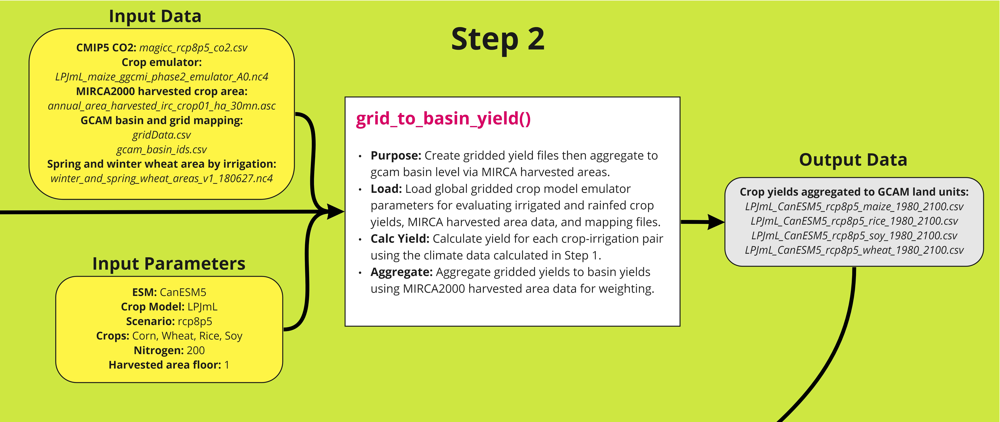

<!-------------------------->
<!-------------------------->
<!-- HTML styles items    -->
<!-------------------------->
<!-------------------------->

<style>
.button {
  background-color: #555555;
  border-radius: 8px;
  border: none;
  color: white;
  padding: 15px 32px;
  text-align: center;
  text-decoration: none;
  display: inline-block;
  font-size: 16px;
  margin: 4px 2px;
  cursor: pointer;
}

.button:hover {
  box-shadow: 0 12px 16px 0 rgba(0,0,0,0.24), 0 17px 50px 0 rgba(0,0,0,0.19);
  background-color: #555555;
  color: gold;
}

</style>

<!-------------------------->
<!-------------------------->
# Introduction
<!-------------------------->
<!-------------------------->
<p align="center"> </p>

Introduction to Osiris. Describe overall concept and purpose then list the four steps n bullets with breif descriptions of each.

<p align="center" style="font-size:18px;"> *Workflow Summary* </p>
<p align="center"> </p>

<p align="center" style="font-size:18px;"> *Workflow Details* </p>
<p align="center"> </p>


<!-------------------------->
<!-------------------------->
# Install
<!-------------------------->
<!-------------------------->
<p align="center"> </p>

1. Download and install:
    - R (https://www.r-project.org/)
    - R studio (https://www.rstudio.com/) (Optional)
    
    
2. In R or R studio:

```r
install.packages("devtools")
devtools::install_github("JGCRI/osiris")
```

Additional steps for UBUNTU from a terminal
```
sudo add-apt-repository ppa:ubuntugis/ppa
sudo apt-get update
sudo apt-get install -y libcurl4-openssl-dev libssl-dev libxml2-dev libudunits2-dev libavfilter-dev  libmagick++-dev
```

Additional steps for MACOSX from a terminal
```
brew install pkg-config
```

<!-------------------------->
<!-------------------------->
# Step 1
<!-------------------------->
<!-------------------------->
<p align="center"> </p>

Description here with reference to figure, table and script below. All exogenous inputs should have sources and doi's.

## Workflow
<p align="center" style="font-size:18px;"> *Step 1 Workflow* </p>
<p align="center"> </p>

## Table

## Example Script
```{r, results = "hide", eval=FALSE, echo=TRUE, warning=FALSE, error = FALSE, message = FALSE}
library(osiris)
# Step 1: calculate_deltas_from_climate
osiris::calculate_deltas_from_climate(
  climate_dir = paste0(data_folder,"/climate_data"),
  write_dir = paste0(data_folder,"/outputs_calculate_delta_from_climate"),
  monthly_growing_season = paste0(data_folder,"/growing_seasons/pmonth_gslength_unifWheat_smallareamask.csv"),
  monthly_harvest_season = paste0(data_folder,"/growing_seasons/p_h_months_unifWheat_smallareamask.csv"),
  growing_season_dir = paste0(data_folder,"/growing_season_climate_data"),
  esm_name = 'CanESM5',
  crops = c("Corn", "Wheat", "Rice", "Soy"),
  irrigation_rainfed = c("IRR", "RFD"),
  minlat = -87.8638,
  minlon = -179.75,
  rollingAvgYears = 15
)
```


<!-------------------------->
<!-------------------------->
# Step 2
<!-------------------------->
<!-------------------------->
<p align="center"> </p>

Description here with reference to figure, table and script below. All exogenous inputs should have sources and doi's.

## Workflow
<p align="center" style="font-size:18px;"> *Step 2 Workflow* </p>
<p align="center"> </p>

## Table

## Example Script
```{r, results = "hide", eval=FALSE, echo=TRUE, warning=FALSE, error = FALSE, message = FALSE}
library(osiris)
# Step 2: grid_to_basin_yield
osiris::grid_to_basin_yield(
  carbon = paste0(data_folder,"/yield_response_inputs/magicc_rcp8p5_co2.csv"),
  weight_floor_ha = 1,
  emulator_dir = paste0(data_folder,"/yield_response_fcns/ggcmi_phase2"),
  input_dir = paste0(data_folder,"/outputs_calculate_delta_from_climate"),
  area_dir = paste0(data_folder,"/area_data"),
  basin_grid = paste0(data_folder,"/mapping_data/gridData.csv"),
  basin_id = paste0(data_folder,"/mapping_data/gcam_basin_ids.csv"),
  write_dir = paste0(data_folder,"/outputs_grid_to_basin_yield"),
  wheat_area = paste0(data_folder,"/winter_and_spring_wheat_areas_v1_180627.nc4"),
  crops = c("maize", "rice", "soy", "wheat"),
  esm_name = 'CanESM5',
  cm_name = 'LPJmL',
  scn_name = 'rcp8p5',
  N = 200
)
```


<!-------------------------->
<!-------------------------->
# Step 3
<!-------------------------->
<!-------------------------->
<p align="center"> </p>

Description here with reference to figure, table and script below. All exogenous inputs should have sources and doi's.

## Workflow
<p align="center" style="font-size:18px;"> *Step 3 Workflow* </p>
<p align="center"> </p>

## Table

## Example Script
```{r, results = "hide", eval=FALSE, echo=TRUE, warning=FALSE, error = FALSE, message = FALSE}
library(osiris)
# Step 3: yield_to_gcam_basin
osiris::yield_to_gcam_basin(
  write_dir = paste0(data_folder,"/outputs_yield_to_gcam_basin"),
  emulated_basin_yield_dir = paste0(data_folder,"/outputs_grid_to_basin_yield"),
  iso_GCAM_region_mapping = paste0(data_folder,"/mapping_data/iso_GCAM_regID.csv"),
  FAO_ag_mapping = paste0(data_folder,"/mapping_data/FAO_ag_items_PRODSTAT_expanded_corrected.csv"),
  iso_harvest_area_mapping = paste0(data_folder,"/mapping_data/L100.LDS_ag_HA_ha.csv"),
  iso_GCAM_basin_mapping = paste0(data_folder,"/mapping_data/gcam_basin_ids.csv"),
  max_CCImult = 2.5,
  min_CCImult = 0.01,
  weight_floor_ha = 1,
  rolling_avg_years = 15,
  maxHistYear = 2010,
  minFutYear = 2015,
  maxFutYear = 2100
)
```


<!-------------------------->
<!-------------------------->
# Step 4
<!-------------------------->
<!-------------------------->
<p align="center"> </p>

Description here with reference to figure, table and script below. All exogenous inputs should have sources and doi's.

## Workflow
<p align="center" style="font-size:18px;"> *Step 4 Workflow* </p>
<p align="center"> </p>

## Table

## Example Script
```{r, results = "hide", eval=FALSE, echo=TRUE, warning=FALSE, error = FALSE, message = FALSE}
library(osiris)
# Step 4: create_AgProdChange_xml
osiris::create_AgProdChange_xml(
  write_dir = paste0(data_folder,"/outputs_create_AgProdChange_xml"),
  ag_irr_ref = paste0(data_folder,"/reference_agprodchange/L2052.AgProdChange_ag_irr_ref.csv"),
  bio_irr_ref = paste0(data_folder,"/reference_agprodchange/L2052.AgProdChange_bio_irr_ref.csv"),
  ag_impacts = paste0(data_folder,"/outputs_yield_to_gcam_basin/ag_impacts_rcp_gcm_gcm_R_GLU_C_IRR_allyears_RA31_gridcull_allyroutlier.csv"),
  bio_impacts = paste0(data_folder,"/outputs_yield_to_gcam_basin/bio_impacts_rcp_gcm_gcm_R_GLU_C_IRR_allyears_RA31_gridcull_allyroutlier.csv"),
  GCAM_region_mapping = paste0(data_folder,"/mapping_data/GCAM_region_names.csv"),
  timestep = 5,
  maxHistYear = 2010,
  minFutYear = 2015,
  appliedto = "full"
)
```


